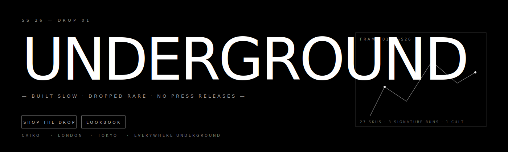
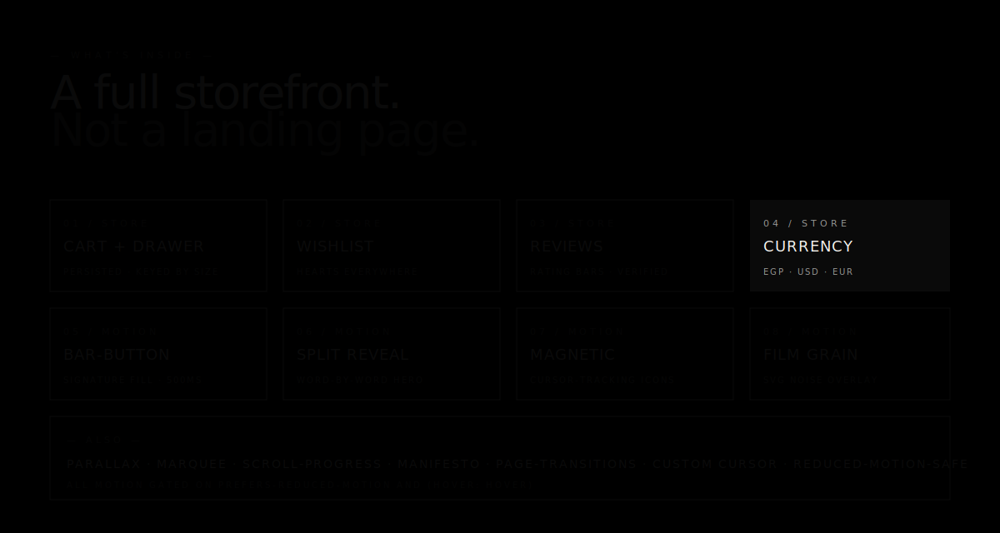
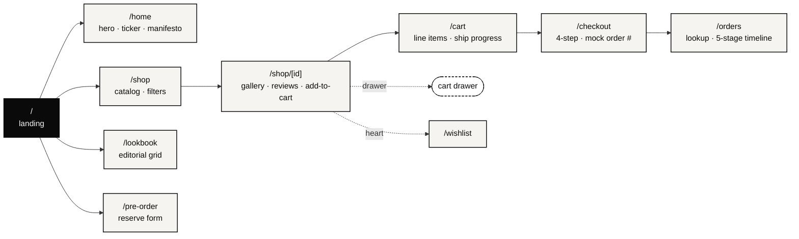
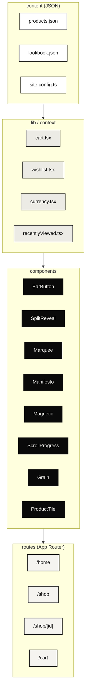

<div align="center">



<br/>

<p>
  
  
  
  
  
</p>

<p>
  
  
  
  
  
  
</p>

<h3><code>BUILT SLOW&nbsp;&nbsp;·&nbsp;&nbsp;DROPPED RARE&nbsp;&nbsp;·&nbsp;&nbsp;NO PRESS RELEASES</code></h3>

<p><sub><a href="#-quick-start">quick start</a> &nbsp;·&nbsp; <a href="#-whats-inside">what&rsquo;s inside</a> &nbsp;·&nbsp; <a href="#-motion">motion</a> &nbsp;·&nbsp; <a href="#-the-map">the map</a> &nbsp;·&nbsp; <a href="#-customise">customise</a> &nbsp;·&nbsp; <a href="#-ship-it">ship it</a></sub></p>

</div>

---

<div align="center">
  
</div>

---

## 🚀 Quick start

```bash
git clone https://github.com/FlutterSmith/underground-streetwear.git
cd underground-streetwear && npm i && npm run dev
```

<sub>Open <code>http://localhost:3000</code>. First paint is already on-brand.</sub>

---

## 🖤 What's inside

<table width="100%">
<tr>
<td width="33%" valign="top">

### 🛒 Store
```diff
+ Cart + slide-in drawer
+ Wishlist ♡
+ Currency EGP/USD/EUR
+ Stock urgency
+ Sold-out waitlist
+ Reviews + rating bars
+ Free-ship progress
+ Recently viewed
+ Quick-add on hover
```

</td>
<td width="33%" valign="top">

### 🎞 Motion
```diff
+ BarButton fill  (500ms)
+ Split-text reveal
+ Image clip-path wipe
+ Magnetic cursor pull
+ Scroll-progress bar
+ Page transitions
+ Film-grain overlay
+ Marquee ticker
+ Manifesto rotator
```

</td>
<td width="33%" valign="top">

### 🧠 Engineering
```diff
+ Next 15 · App Router
+ React 19 · strict TS
+ Tailwind v4 @theme
+ Zero state libs
+ SSR-safe (hydration tests)
+ Content = JSON
+ Reduced-motion honoured
+ a11y focus rings
+ Lighthouse 90+ target
```

</td>
</tr>
</table>

---

## 🎞 Motion

<table width="100%">
<tr>
<th align="left" width="24%">Signal</th>
<th align="left" width="52%">Feel</th>
<th align="left" width="24%">Gated on</th>
</tr>
<tr><td><code>&lt;BarButton /&gt;</code></td><td>&nbsp;<kbd>rest</kbd>&nbsp;━━━━━━━━━━━━━━━━&nbsp;<kbd>hover</kbd>&nbsp;&nbsp;⟶&nbsp;&nbsp;<kbd>▰▰▰▰▰▰▰▰▰▰</kbd></td><td>reduced-motion</td></tr>
<tr><td><code>&lt;SplitReveal /&gt;</code></td><td>&nbsp;word · word · word · word&nbsp;↑</td><td>reduced-motion</td></tr>
<tr><td><code>&lt;Magnetic /&gt;</code></td><td>&nbsp;🧲&nbsp;icon drifts toward cursor within&nbsp;<code>120px</code></td><td>hover:hover + RM</td></tr>
<tr><td><code>&lt;ScrollProgress /&gt;</code></td><td>&nbsp;━━━━━━━━━━━━━━━━━━━━━━━━━━━━&nbsp;<kbd>0 → 1</kbd>&nbsp;spring</td><td>always on (thin)</td></tr>
<tr><td><code>&lt;Grain /&gt;</code></td><td>&nbsp;fractalNoise · 8% opacity · <code>steps(8)</code> shift</td><td>reduced-motion</td></tr>
<tr><td><code>&lt;Marquee /&gt;</code></td><td>&nbsp;←&nbsp;<code>SS 26 ✦ BUILT SLOW ✦ SHIPPED RARE ✦ CAIRO ✦ …</code>&nbsp;←</td><td>reduced-motion</td></tr>
<tr><td><code>&lt;Manifesto /&gt;</code></td><td>&nbsp;line&nbsp;↑fade&nbsp;&nbsp;·&nbsp;&nbsp;blur&nbsp;&nbsp;·&nbsp;&nbsp;5&nbsp;states rotate</td><td>reduced-motion</td></tr>
<tr><td><code>&lt;PageTransition /&gt;</code></td><td>&nbsp;AnimatePresence keyed on pathname</td><td>reduced-motion</td></tr>
<tr><td><code>&lt;Cursor /&gt;</code></td><td>&nbsp;◉ white dot, scales on interactive targets</td><td>hover:hover</td></tr>
<tr><td><code>ProductTile rotation</code></td><td>&nbsp;seeded (FNV-1a → mulberry32) · ±8°</td><td>SSR-matched</td></tr>
</table>

---

## 🗺 The map



---

## 🧬 Architecture



---

## 🎛 Customise

<table width="100%">
<tr>
<td width="50%" valign="top">

### 1. Brand
<sub><code>src/config/site.config.ts</code></sub>
```ts
brandName: "UNDERGROUND",
taglines:  ["…", "Underground by design."],
socials:   [{ icon: "ig", href: "…" }, …],
```

### 2. Tokens
<sub><code>src/app/globals.css</code> · Tailwind <code>@theme</code></sub>
```css
--color-bg-light: #f5f4f0;
--color-bg-dark:  #0a0a0a;
--font-sans:      var(--font-inter);
```

</td>
<td width="50%" valign="top">

### 3. Product
<sub><code>src/content/products.json</code> — hot-reloads</sub>
```jsonc
{
  "id":   "wool-cardigan-01",
  "name": "CARDIGAN",
  "priceEGP": 2200,
  "image":   "…",
  "gallery": ["…","…","…"],
  "category": "other",
  "sizes":  ["S","M","L"],
  "stock":  12,
  "reviews": [ … ]
}
```

</td>
</tr>
</table>

---

## 🛰 Backend hooks

<sub>Every form ships as a client-side scaffold with a 600ms fake latency. Wire these before launch.</sub>

| Form | File | Drop-in |
| :--- | :--- | :--- |
| 📧 &nbsp;Contact | `app/contact/page.tsx` | Resend · Postmark · Formspree |
| ⏳ &nbsp;Pre-order | `app/pre-order/page.tsx` | Resend + Airtable |
| 📰 &nbsp;Newsletter | `components/Newsletter.tsx` | Mailchimp · ConvertKit · Beehiiv |
| 🕯 &nbsp;Waitlist | `app/shop/[id]/ProductDetail.tsx` | same as newsletter |
| 💳 &nbsp;Checkout | `app/checkout/page.tsx` | **Stripe** · **Paymob** · **Fawry** |
| 📦 &nbsp;Orders | `app/orders/page.tsx` | your orders DB · Shopify Admin |

---

## 🧾 Scripts

```bash
npm run dev         #  ▶  next dev
npm run build       #  📦 20+ static pages
npm run lint        #  ✓  zero warnings
npm run typecheck   #  ✓  tsc --noEmit
npm run start       #  🚀 serve production build
```

---

## 🚢 Ship it

<div align="center">

|  |  |  |  |
|:---:|:---:|:---:|:---:|
| **Vercel** | **Netlify** | **Cloudflare&nbsp;Pages** | **Firebase&nbsp;App&nbsp;Hosting** |
| `vercel --prod` | `netlify deploy --prod` | framework preset: Next | Blaze plan + console |

</div>

<sub>Static-first: `next build` prerenders every route and one HTML per product. No SSR server required unless you add one.</sub>

---

## ♿ Accessibility & performance

<table width="100%">
<tr>
<td width="50%" valign="top">

### ♿ a11y
```
✓  AA contrast · both themes
✓  focus-visible rings everywhere
✓  aria-pressed on toggles
✓  aria-label on icon-only controls
✓  prefers-reduced-motion honoured
✓  skip-friendly DOM order
✓  keyboard-usable cart + menus
```

</td>
<td width="50%" valign="top">

### ⚡ perf
```
✓  all routes statically prerendered
✓  next/image auto webp + sizes
✓  next/font self-hosted (no FOUT)
✓  rAF cursor (no re-render on move)
✓  motion components lazy-evaluated
✓  SSR-safe (no hydration warnings)
✓  Lighthouse 90+ target
```

</td>
</tr>
</table>

---

## 🧭 Roadmap

<sub>The storefront is complete. These push it further.</sub>

- [ ] 🎁 &nbsp;**Bundles** — "Hoodie + Pants saves 10%"
- [ ] ✍️ &nbsp;**Review submission** (UI is read-only today)
- [ ] ⭐ &nbsp;**Loyalty / referrals**
- [ ] 🌐 &nbsp;**Arabic RTL mirror**
- [ ] 🎨 &nbsp;**Variants beyond size** (color, material)
- [ ] 📦 &nbsp;**Live inventory sync**

---

## 📜 License

<sub>Commercial template. One brand per seat. The repo is public so you can preview — production use requires a license. Open an issue to get one.</sub>

## 🙏 Credits

<sub>Photography via <a href="https://unsplash.com">Unsplash</a> (free for commercial, replace with your own pre-launch). Fonts via <code>next/font</code>. Built on <a href="https://nextjs.org">Next.js</a> · <a href="https://tailwindcss.com">Tailwind</a> · <a href="https://www.framer.com/motion/">Framer Motion</a>.</sub>

---

<div align="center">

### Built by Ahmed Hamdy

<sub>Open to commissions: brand sites · e-commerce · bespoke front-end.</sub>

<a href="https://github.com/FlutterSmith"></a>

<br/><br/>

<sub>★ &nbsp; If this saved you a week of work, a star means a lot. &nbsp; ★</sub>

</div>
